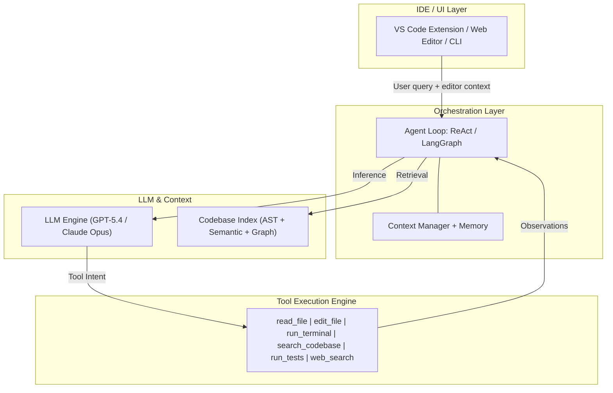
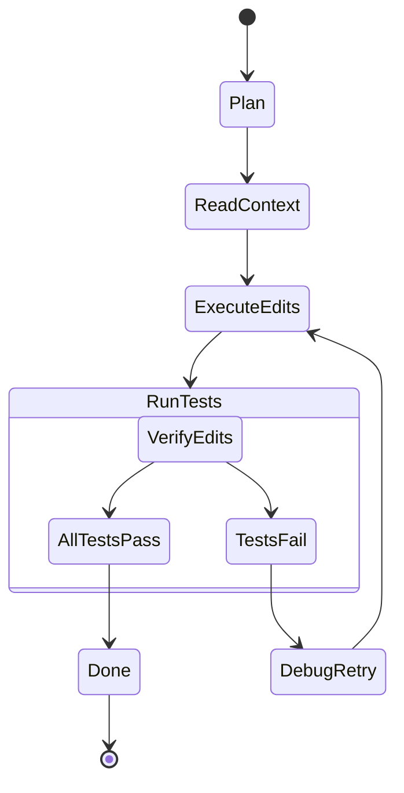

# Case Study: Designing an Autonomous Code Editor (Cursor / Claude Code)

An autonomous code editor is one of the most technically demanding Agentic AI systems to design. It operates in an environment where actions have **real, immediate side effects** (files change on disk), context is enormous (entire codebases), latency expectations are tight (interactive UX), and safety requirements are critical (don't break production code). This case study walks through the end-to-end system design interview for such a product.

---

## 1. Problem Formulation

**Prompt:** *"Design an AI-powered coding assistant that can understand a codebase and autonomously make multi-file code changes based on natural language instructions."*

### Clarifying Questions to Ask
* **What is the primary use case?** Autocomplete suggestions, single-file edits, or multi-file autonomous refactors (each has dramatically different architecture)?
* **What is the target environment?** IDE plugin (VS Code extension) vs. cloud-based editor vs. CLI agent?
* **What languages/frameworks must be supported?** A polyglot system is much harder than Python-only.
* **What is the acceptable latency for suggestions?** Autocomplete must be <300ms. Agentic refactors can be async (minutes).
* **What are the rollback/safety requirements?** Can the agent apply changes directly to files, or must all changes be reviewed by the human first?
* **What is the scale?** Single-user local tool vs. multi-tenant SaaS serving thousands of developers?

### Defining Success Metrics

**Offline Metrics:**
* **Edit Acceptance Rate (EAR):** % of AI-suggested edits the developer accepts without modification. Target: >60%.
* **Exact Match & BLEU/CodeBLEU:** Against a benchmark of known correct code completions.
* **Test Pass Rate:** After the agent makes a change, what % of the existing test suite still passes?
* **Tool Trajectory Accuracy:** Does the agent use the correct sequence of tools (read file → edit → run tests) to accomplish a task?

**Online Metrics:**
* **Session Engagement:** How often does the user invoke agent features per coding session?
* **Time-to-Completion:** How much faster does a developer complete a task with the agent vs. without?
* **Revert Rate:** How often does the developer undo the agent's changes — the primary signal of agent failure.
* **Error Injection Rate:** % of agent-initiated changes that introduce a new failing test or runtime error.

---

## 2. High-Level Architecture



---

## 3. Codebase Indexing: The Context Engine

The central challenge of a code editor agent is **context retrieval** at scale. A codebase can contain thousands of files. Naively injecting all code into the LLM context window is impossible (cost and length). The system must surgically retrieve the *right* context for each task.

### Three-Layer Codebase Index

**Layer 1 — Semantic Search (Embeddings)**
* Every function, class, and file is embedded using a code-specialized embedding model (e.g., `text-embedding-3-large` or a fine-tuned code embedder).
* Stored in a local Vector DB (LanceDB or Qdrant, running locally for privacy).
* Enables: *"Find all functions related to authentication"* — semantic intent matching.

**Layer 2 — AST (Abstract Syntax Tree) Graph**
* Parse every source file into its AST using language-specific parsers (Tree-sitter supports 100+ languages).
* Build a graph of: `file → imports file`, `function → calls function`, `class → inherits class`.
* Enables: *"What files will break if I change this function's signature?"* — precise dependency impact analysis.

**Layer 3 — Full-Text / Keyword Index**
* A fast BM25 index over raw source code for exact symbol lookups: class names, variable names, error messages.
* Enables: *"Find all usages of `UserAuthService`"* — exact token matching that semantic search misses.

> **Rule of Thumb:** Always use all three layers in hybrid retrieval. Semantic search finds related concepts; AST gives exact call graphs; keyword search finds exact symbol names. None of the three alone is sufficient.

---

## 4. The Tool Space

The agent controls the editor through a well-defined set of tools:

| Tool | Description | Risk Level |
|---|---|---|
| `read_file(path)` | Read file content | Read-only: safe |
| `search_codebase(query)` | Semantic + keyword search across index | Read-only: safe |
| `list_directory(path)` | List files in a directory | Read-only: safe |
| `edit_file(path, old_str, new_str)` | Apply a precise string replacement | **Mutating** |
| `create_file(path, content)` | Create a new file | **Mutating** |
| `run_terminal(command)` | Execute a shell command | **Critical Risk** |
| `run_tests(test_path)` | Run the test suite and return results | **Mutating** |
| `web_search(query)` | Search for documentation or error messages | External |

### Tool Design Decisions

**`edit_file` uses `old_str/new_str` replace — not line numbers.** Line numbers shift as edits accumulate across a session. String replacement is more robust for multi-edit sessions.

**`run_terminal` requires explicit sandboxing.** This is the highest-risk tool in the system — an LLM with shell access can delete files, install packages, or exfiltrate data. Mitigations:
* Run in a Docker container with a read-only bind mount of the project.
* Whitelist only specific commands (`pytest`, `npm test`, `python`, `git diff`).
* Any command touching `/etc`, `/sys`, or sensitive paths is blocked at the execution layer before the shell sees it.

**Model Context Protocol (MCP)** is increasingly used as the standard interface between agents and IDE tools — meaning the same MCP Server exposing file operations can be consumed by Claude Code, Cursor, or custom agents without any custom integration code.

---

## 5. The Agent Execution Loop

For a multi-file refactor task ("Migrate all uses of the old `Logger` class to the new `StructuredLogger`"), the agent follows this trajectory:

```
[User]: Migrate all usages of Logger to StructuredLogger across the codebase.

[Thought]: I need to find all files importing Logger first.
[Tool]: search_codebase(query="import Logger", type="exact")
[Result]: ["auth/service.py", "api/routes.py", "utils/helpers.py"]

[Thought]: I'll read auth/service.py first to understand the usage pattern.
[Tool]: read_file("auth/service.py")
[Result]: <file contents>

[Thought]: I see the pattern. I'll apply the edit.
[Tool]: edit_file("auth/service.py", old="from utils import Logger", new="from utils import StructuredLogger")
[Tool]: edit_file("auth/service.py", old="Logger(name=__name__)", new="StructuredLogger(name=__name__)")
[Result]: Success

[Thought]: Repeat for api/routes.py and utils/helpers.py ...

[Thought]: All edits complete. I should verify by running the test suite.
[Tool]: run_tests("tests/")
[Result]: 47 passed, 0 failed.

[Final Answer]: Migration complete. Updated 3 files. All 47 tests pass.
```

### State Machine vs. Raw ReAct

For a production code editor, a **raw ReAct loop is insufficient**. Use a **LangGraph state machine** with explicit nodes:



This prevents the agent from entering an infinite correction loop and gives you explicit retry/abort policies.

---

## 6. Context & Memory Management

### The Context Budget
A typical agentic task might consume 100K–500K tokens across its trajectory. At frontier model pricing, an unconstrained agent can easily cost $1–5 per complex refactor. Context management is an economic necessity, not an optimization.

**Strategy:**
* **Retrieval over injection:** Never inject an entire file if you can retrieve only the relevant function/class. Use the AST index to extract just the targeted symbol.
* **Summarize past steps:** After completing each file, summarize the changes made in one sentence. Discard the raw file content from context.
* **TOON for tool schemas:** Encode the 8 tool schemas in TOON format instead of verbose JSON. Saves ~40% of the system prompt token budget, freeing space for actual code context.
* **Sliding window on history:** Keep only the last 3 tool-call/result pairs in the active context. Older history is summarized and stored externally.

---

## 7. Safety & Human-in-the-Loop Design

An autonomous code editor that applies changes without review is a career-ending liability. Layer defense in depth:

1. **Read-only mode by default:** The agent plans all proposed edits and shows them as a unified `git diff`-style preview. Changes are only applied after explicit user approval.
2. **Atomic commits:** Every agent session creates a single Git commit. A one-command rollback (`git revert`) undoes everything.
3. **Test gate:** `run_tests` is mandatory before marking any agentic task complete. If tests fail and the agent cannot fix them within N retries, it escalates to the human with a diff of what it attempted.
4. **Scope constraint:** The agent is initialized with an explicit list of files it is permitted to modify for this task. It cannot edit files outside the declared scope — enforced at the execution layer, not via prompt alone.

> **Key Interview Point:** Safety constraints must be enforced at the **execution layer**, not just in the system prompt. An LLM can be jailbroken or confused — your code must be the final authority on what actions are physically permitted.

---

## 8. Scaling & Production Considerations

| Concern | Solution |
|---|---|
| **Latency for autocomplete** | Dedicated smaller model (e.g., Llama 4 Scout or Qwen-2.5 7B) with <300ms SLA; preemptively embed cursor context on keystroke |
| **Latency for agentic tasks** | Async background job with streaming progress updates to UI |
| **Codebase index freshness** | File-watcher daemon (FSEvents/inotify) re-indexes changed files incrementally |
| **Multi-language support** | Tree-sitter for parsing (supports 150+ grammars); language-agnostic embedding model |
| **Cost control** | Semantic caching of repeated queries; model routing (cheap model for autocomplete, frontier for agentic tasks) |
| **Multi-tenant isolation** | Separate Vector DB namespace and file permission scope per user/project |
